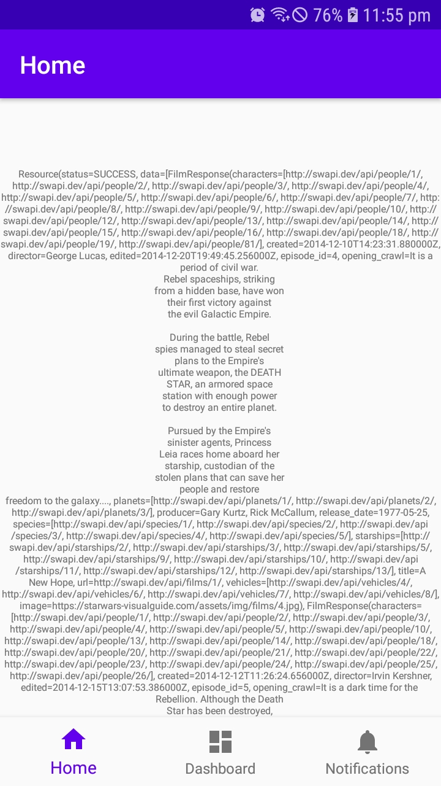
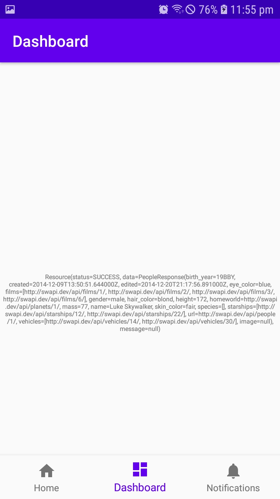
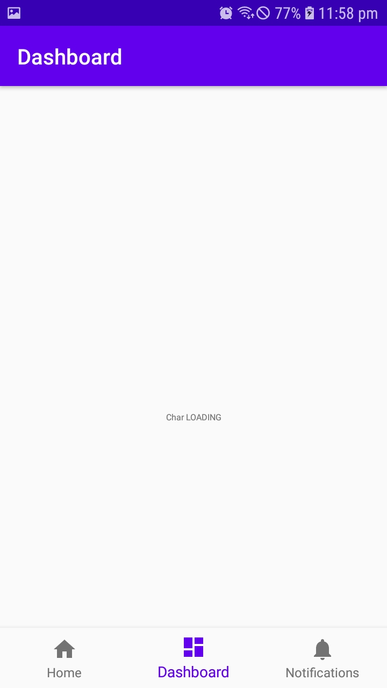

# Star-War-Explore

This is my second project in Android Kotlin. I had my first project on Android Kotlin 9 days back through [another interview assessment](https://github.com/its-mash/SG-MobileData-Statistics).

If you map my codes with my 9 days experience, you will have a idea of the possibility of me.

## Points

- [x] MVVM architecture
- [x] Unit Testing- Junit 4
- [x] 5 Minutes online Data cache, 7 Days offline Data cache
- [x] Dependency Injection using Dagger Hilt of Api, Repository
- [X] Combined swapi.dev data +   "https://starwars-visualguide.com/assets/img/films/{episodeNumber.jpg}"+ "https://akabab.github.io/starwars-api/api/all.json" to same data class, thus added film's banner image link and characters image link data for better card view
- [x] Added Character query by film
- [x] Added raw data view in fragment with Live data and error handling

## ToDo(Features I wanted/want to add)
- [ ] All sort of data preparation  and testing is complete. Only frontend data visualization parts are not complete yet
- [ ] Expandable Tree View of swapi.dev endpoints and data
- [ ] Clickable CardView of films
- [ ] Expanded view of film
- [ ] Clickable CardView of Characters of a particular film
- [ ] Expanded view of Characters details
- [ ] Add to watch Later features ( Just to show Room Database usage)

## Screenshots

| All Films Data  |  First Films Characters |  Data when loading or error  |
|---|---|---|
|   |   |   |
